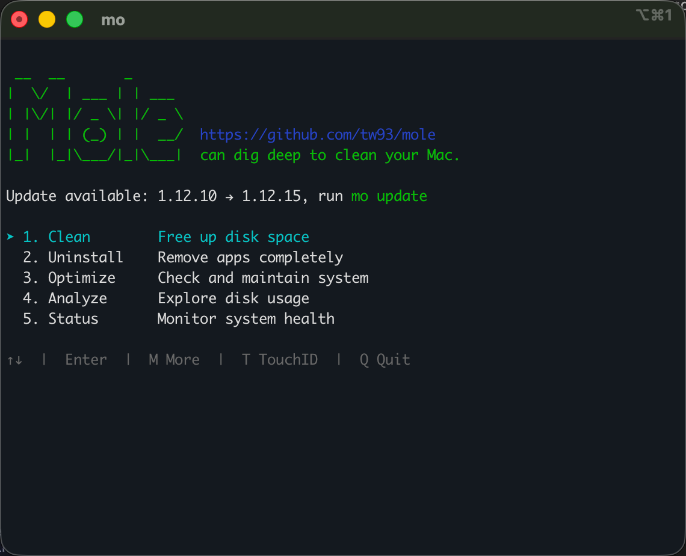
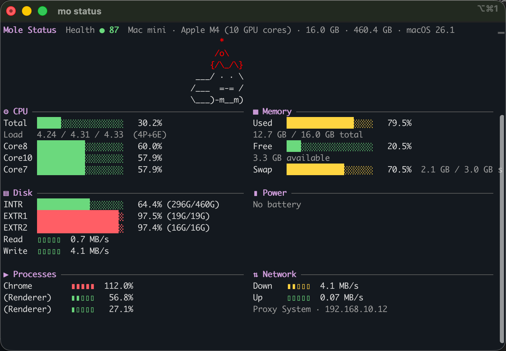

## 痛点
作为全栈向的开发，我的 512G 款 Mac 经常会遇到空间不足的问题。

## 安装
```
brew install tw93/tap/mole
```

## 简单品几句
AI 模型 CI 盛行的当下，对 Mole 这种 Clean Mac CI 喜爱度拔高了两度。
命令行输入 `mo`, 就能看到支持的完整指令 List：


Mole 的颜色排版都设计得非常精美：


空间不足时，使用 `mo clean` 常常可以清理 20+ G 的空间，节省心智。