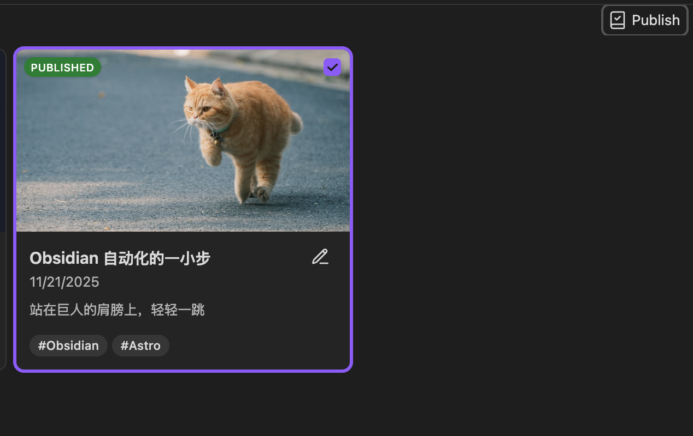
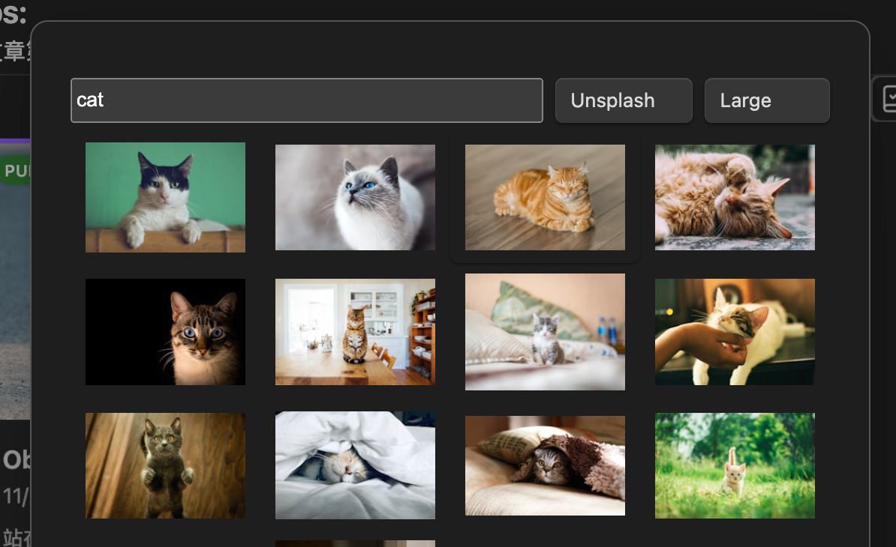

*Photo by [Duc Van](https://unsplash.com/@duke91?utm_source=Obsidian%20Image%20Inserter%20Plugin&utm_medium=referral) on [Unsplash](https://unsplash.com/?utm_source=Obsidian%20Image%20Inserter%20Plugin&utm_medium=referral)*

## 站在巨人的肩膀上
[Astro Suite for Obsidian - YouTube](https://www.youtube.com/watch?v=ZhizarvwLnU&t=5s)，使用了现成的 Obsidian 套件。Astro 发布也是直接 Frok 官网的[Slate Blog \| Astro](https://astro.build/themes/details/slate-blog/)。

## 轻轻一跃
挂载在 Cloudflare Pages 上，白嫖的美。

### Tips:
新文章第一次发布，需要在 Cmd+T 的看板上选择 Published：

## 快乐所在
1. 全程都在 Obsidian 一个软件上操作，且插件生态丰富。
2. `Cmd+‘`，唤起 Unsplash 在线图库 图库自由， `Cmd+S` 自动修复 Link 错误。
3. `Cmd+Shift+S`自动一键发布。