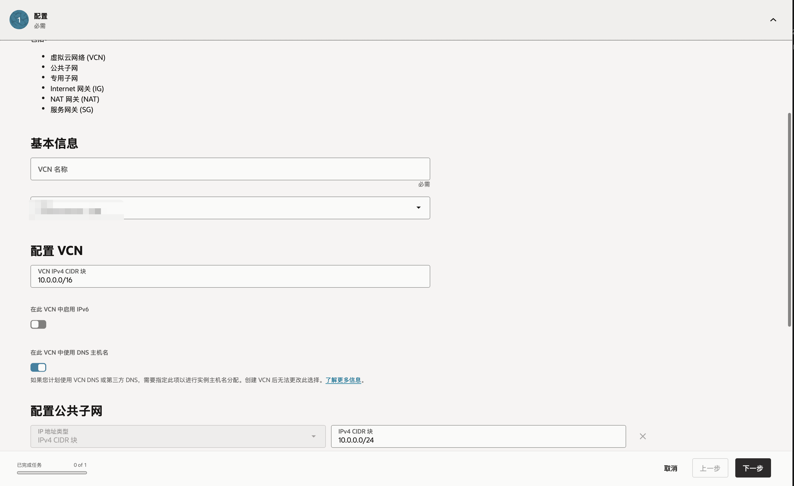
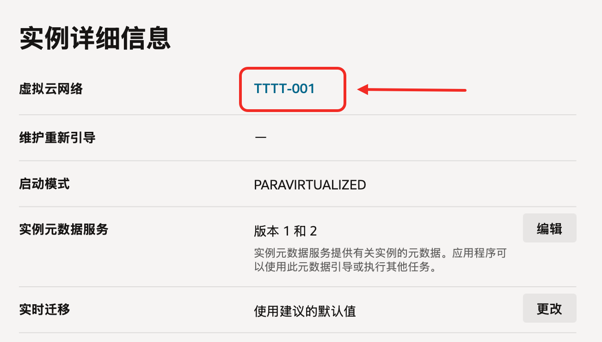

*Photo by [BoliviaInteligente](https://unsplash.com/@boliviainteligente?utm_source=Obsidian%20Image%20Inserter%20Plugin&utm_medium=referral) on [Unsplash](https://unsplash.com/?utm_source=Obsidian%20Image%20Inserter%20Plugin&utm_medium=referral)*
## 在创建实例之前
在[Oracle Cloud Infrastructure](https://cloud.oracle.com/networking) ，选中红框中`创建具有Internet 连接的 VCN`
按照指引，一路确认即可。



## VCN创建完成进入SSH之前
打开 [Oracle Cloud Infrastructure](https://cloud.oracle.com/compute/instances)，点击需要使用的 VCN。在「详细信息」中，点击如图的「虚拟云网络」
依次点击「安全」，「创建安全列表」：

一般出站规则都是 Allow All，入站规则需要做一点傻瓜处理：
1. 「源 CIDR」 输入提示的「10.0.0.0/16」（不同的人可能看到的不同，根据提示的内容填充）
2. 「IP 协议」选择「所有协议」。


## SSH完成连接后
切换到 root 用户
```
sudo -i
```
放行所有端口
```
sudo iptables -P INPUT ACCEPT && sudo iptables -P FORWARD ACCEPT && sudo iptables -P OUTPUT ACCEPT && sudo iptables -F
```

## 开始享用
后续的使用已经不容易遇到因为端口引起的莫名其妙的问题了。Have Fun！
