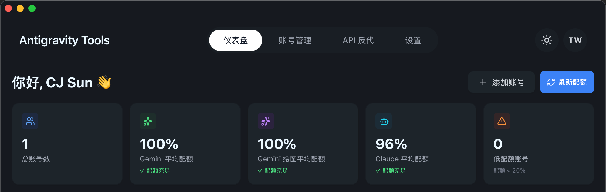
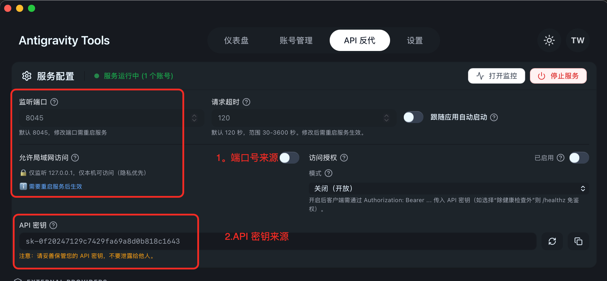
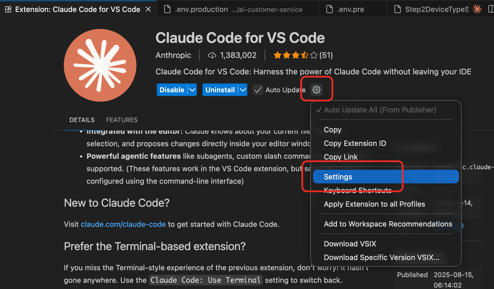
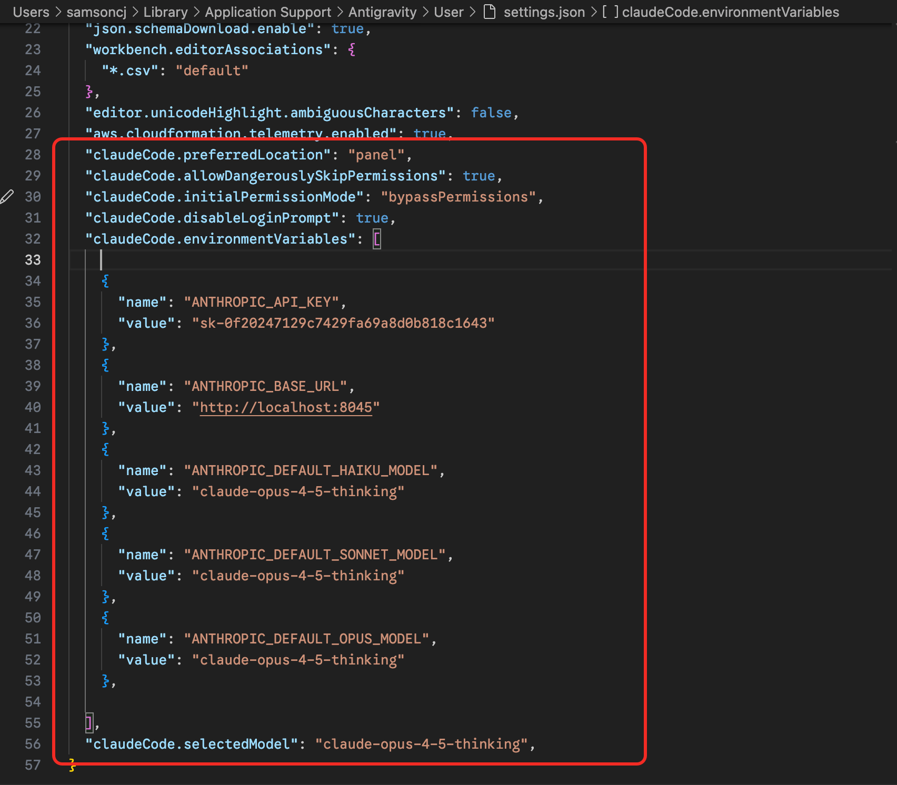
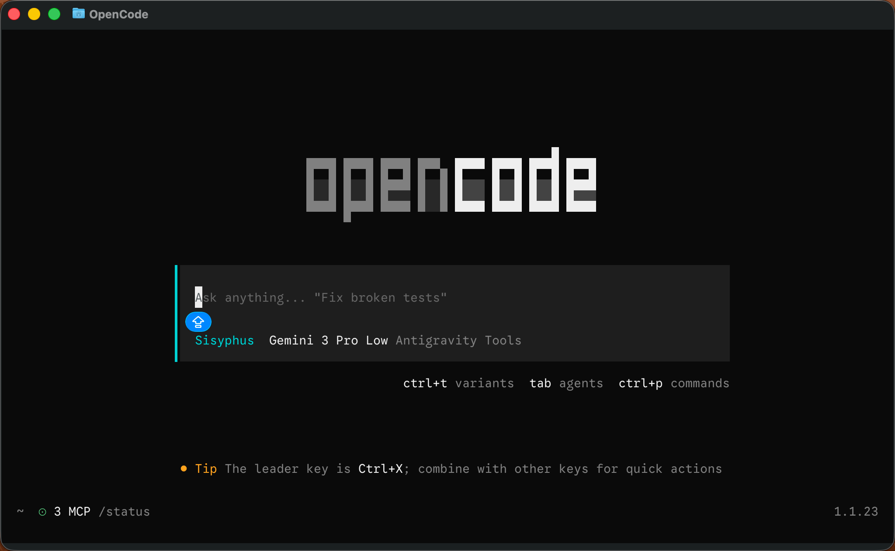
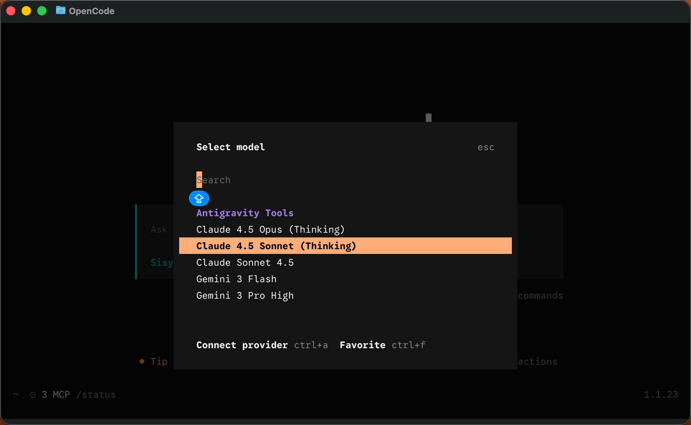
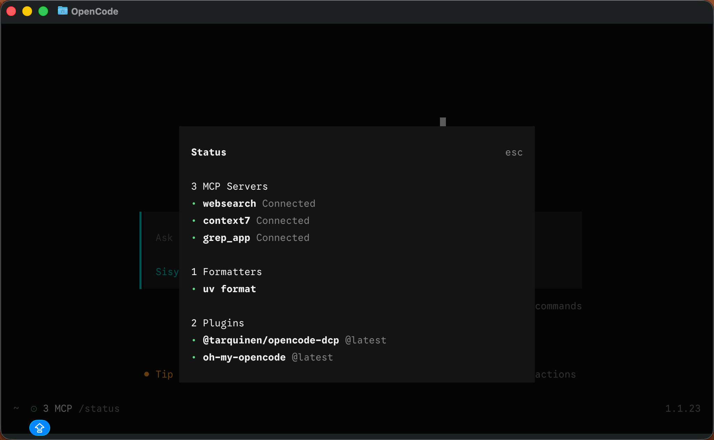

*Photo by [Matt Artz](https://unsplash.com/@mattartz?utm_source=Obsidian%20Image%20Inserter%20Plugin&utm_medium=referral) on [Unsplash](https://unsplash.com/?utm_source=Obsidian%20Image%20Inserter%20Plugin&utm_medium=referral)*
## Claude Code 配置
### 安装 Antigravity Manager
[GitHub - lbjlaq/Antigravity-Manager: 为 Antigravity 提供一键无缝账号切换功能。](https://github.com/lbjlaq/Antigravity-Manager)
```bash
# 1. 订阅本仓库的 Tap
brew tap lbjlaq/antigravity-manager https://github.com/lbjlaq/Antigravity-Manager

# 2. 安装应用
brew install --cask antigravity-tools
```

### 登录&打开「API反代」
1. 登录
   登录成功后：
   
2. 打开「API反代」
   打开成功后：
   
### Terminal环境&插件配置

ANTHROPIC_AUTH_TOKEN&ANTHROPIC_BASE_URL来源：



### Terminal 环境

sk-... 根据实际来配置比如上图的 sk-0f20247129c7429fa69a8d0b818c1643
临时：
```bash
cd your-project-folder
export ANTHROPIC_AUTH_TOKEN=sk-...
export ANTHROPIC_BASE_URL=http://localhost:8045
claude
```
全局：
```bash
echo -e '\n export ANTHROPIC_AUTH_TOKEN=sk-...' >> ~/.bash_profile
echo -e '\n export ANTHROPIC_BASE_URL=http://localhost:8045' >> ~/.bash_profile
echo -e '\n export ANTHROPIC_AUTH_TOKEN=sk-...' >> ~/.bashrc
echo -e '\n export ANTHROPIC_BASE_URL=http://localhost:8045' >> ~/.bashrc
echo -e '\n export ANTHROPIC_AUTH_TOKEN=sk-...' >> ~/.zshrc
echo -e '\n export ANTHROPIC_BASE_URL=http://localhost:8045' >> ~/.zshrc
```

### VS Claude Code 插件配置

依次如图点击：
插件入口进设置：



设置页进配置 json：


json配置关键的配置项：


```json
"claudeCode.preferredLocation": "panel",

"claudeCode.allowDangerouslySkipPermissions": true,

"claudeCode.initialPermissionMode": "bypassPermissions",

"claudeCode.disableLoginPrompt": true,

"claudeCode.environmentVariables": [

{

"name": "ANTHROPIC_API_KEY",

"value": "sk-0f20247129c7429fa69a8d0b818c1643"

},

{

"name": "ANTHROPIC_BASE_URL",

"value": "http://localhost:8045"

},

{

"name": "ANTHROPIC_DEFAULT_HAIKU_MODEL",

"value": "claude-opus-4-5-thinking"

},

{

"name": "ANTHROPIC_DEFAULT_SONNET_MODEL",

"value": "claude-opus-4-5-thinking"

},

{

"name": "ANTHROPIC_DEFAULT_OPUS_MODEL",

"value": "claude-opus-4-5-thinking"

},

],

"claudeCode.selectedModel": "claude-opus-4-5-thinking",
```


### 体验 Google 的 Opus 额度
 `claude` 启动!!!


## 更新 OpenCode（oh-my-opencode） 配置
打开[https://opencode.ai](https://opencode.ai/) 安装自己喜欢的方式，安装OpenCode。
安装完成后在 ` ~/.config/opencode/opencode.json`  调整配置:
```json
{
  "plugin": [
    "oh-my-opencode", // 瑞士军刀，多 Agent 编排
    "@tarquinen/opencode-dcp@latest", // 动态上下文修剪
  ],
  "provider": {
    "CLIProxyAPI": {
      "name": "Antigravity Tools", 
      "options": {
        "baseURL": "http://127.0.0.1:8045/v1", // Antigravity Tools 配置的监听端口
        "apiKey": "sk-0f20247129c7429fa69a8d0b818c1643" // Antigravity Tools 配置的 API 密钥
      },
      "models": { // Antigravity Tools 里的可用模型列表
        "claude-sonnet-4.5": { // 代码推理
          "name": "Claude Sonnet 4.5"
        },
        "claude-sonnet-4-5-thinking": { // 思维链
          "name": "Claude 4.5 Sonnet (Thinking)"
        },
        "claude-opus-4-5-thinking": { // 最强思维
          "name": "Claude 4.5 Opus (Thinking)"
        },
        "gemini-3-pro-high": { // 最强推理
          "name": "Gemini 3 Pro High",
          "limit": {
            "context": 1048576,
            "output": 65535
          },
          "modalities": {
            "input": [
              "text",
              "image",
              "pdf"
            ],
            "output": [
              "text"
            ]
          }
        },
        "gemini-3-pro-low": { // 轻量极速
          "name": "Gemini 3 Pro Low",
          "limit": {
            "context": 1048576,
            "output": 65535
          },
          "modalities": {
            "input": [
              "text",
              "image",
              "pdf"
            ],
            "output": [
              "text"
            ]
          }
        },
        "gemini-3-flash": {  // gemini-3-flash
          "name": "Gemini 3 Flash",
          "limit": {
            "context": 1048576,
            "output": 65536
          },
          "modalities": {
            "input": [
              "text",
              "image",
              "pdf"
            ],
            "output": [
              "text"
            ]
          }
        }
      }
    },
  },
  "$schema": "https://opencode.ai/config.json"
}
```
### 更新 oh-my-opencode 配置

打开同层级目录下的 ~/.config/opencode/oh-my-opencode.json

OpenCode 的 glm-4.7-free 不是很稳定，可以替换 OpenRouter中的免费模型或者直接其他你觉得更好的模型。

所有模型都可以自己做调整，我只是根据自己有的模型配置了一些。

```json
{
  "$schema": "https://raw.githubusercontent.com/code-yeongyu/oh-my-CLIProxyAPI/master/assets/oh-my-CLIProxyAPI.schema.json",
  "agents": {
    // 主编排器（西西弗斯）：复杂任务规划、多步骤开发、代理协调
    "Sisyphus": {
      "model": "CLIProxyAPI/gemini-3-pro-low"
    },
    // 研究员：文档查找、开源研究、最佳实践
    "librarian": {
      "model": "CLIProxyAPI/claude-opus-4-5-thinking"
    },
    // 搜索专家：代码定位、依赖追踪、结构理解
    "explore": {
      "model": "CLIProxyAPI/claude-opus-4-5-thinking"
    },
    // 架构顾问（先知）：架构决策、代码审查、技术选型
    "oracle": {
      "model": "CLIProxyAPI/glm-4.7-free"
    },
    // UI/UX 专家：界面设计实现、组件开发、动画
    "frontend-ui-ux-engineer": {
      "model": "CLIProxyAPI/gemini-3-pro-high"
    },
    // 文档专家：README、API 文档、架构文档
    "document-writer": {
      "model": "CLIProxyAPI/glm-4.7-free"
    },
    // 视觉分析师：图片/PDF/图表分析
    "multimodal-looker": {
      "model": "CLIProxyAPI/gemini-3-flash"
    }
  }
}

```

### 使用 OpenCode
oh-my-opencode 需要使用 `ulw` 关键词触发满血状态来处理复杂问题。
打开应该长这样：



输入 `/models` 应该能看到配置的 Antigravity Tools 里的模型：



输入`/status` 应该长这样：
